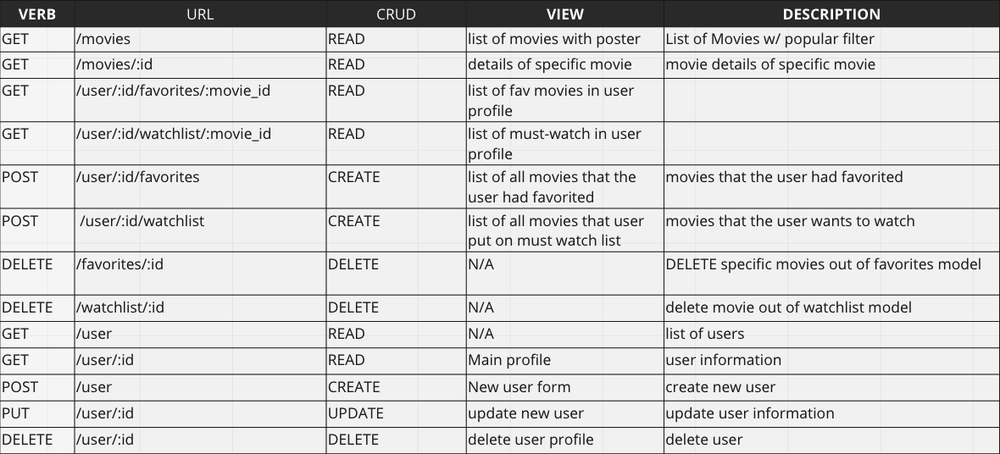
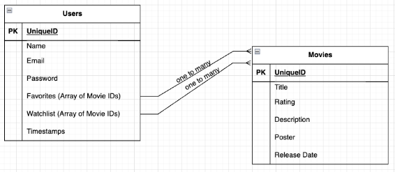

# CineSearch Movie App
Overview: Our team will be creating a movie favoriting app that allows users to save and organize their favorite movies and create a watchlist of movies they want to see in the future. The app will utilize a modern MERN framework to create a responsive and interactive user interface.

## Installation

Clone this repository: 

```git clone https://github.com/your-username/movie-favoriting-app.git```

Navigate to the project directory: 

```cd movie-favoriting-app```

Install the dependencies: 

```npm install```

Create a ```.env``` file and add your TMDb API key: 

```REACT_APP_TMDB_API_KEY=your-api-key```

Start the app: ```npm start```

Open the app in your browser:

 ```http://localhost:3000```

## Tech Stack

 - MongoDB
 - Mongoose
 - Javascript
 - Express
 - TMDb API

## User Story

- As a user, I want to be able to search for a specific movie by its title so I can quickly find it and add it to my favorites.
- As a user, I want to be able to add a movie to my watchlist so that I can remember to watch it later
- As a user, I want to be able to see a list of my favorite movies so that I can quickly access them.
- As a user, I want to be able to delete a movie from my watch or favorite list if I change it
- As a user, I want to be able to move movies between lists
- As a user, I want to have a secure login to my information and lists
- As a user, I want to have imagery attached to the movies I am watching
- As a user, I want to have all relevant information that includes release date, rating, genre, synopsis

## CRUD



## ERD



## MVP 
- Pull movie information from the TMDB API
- Display movie information to the user
- Display movie images and posters
- Allow users to search for movies
- Store a users favorite movies in a Mongo database
- Display lists of popular movies to the user
- Allow users to have a list of movies they want to watch

## Stretch Goals or Minimum Marketable Product
- Display streaming information with the movie details view
- Ability to comment on movies
- Ability to sort/filter by genre
- Notifications if another user comments on a movie you have commented on

## Team Mavericks

 - [Dakota Smith](https://github.com/Dxk0ta)
 - [Anthony Wells](https://github.com/awellsbiz)
 - [Myles Wiegel](https://github.com/mylesw27)
 - [Juan Cabrera](https://github.com/juanedcabrera)

